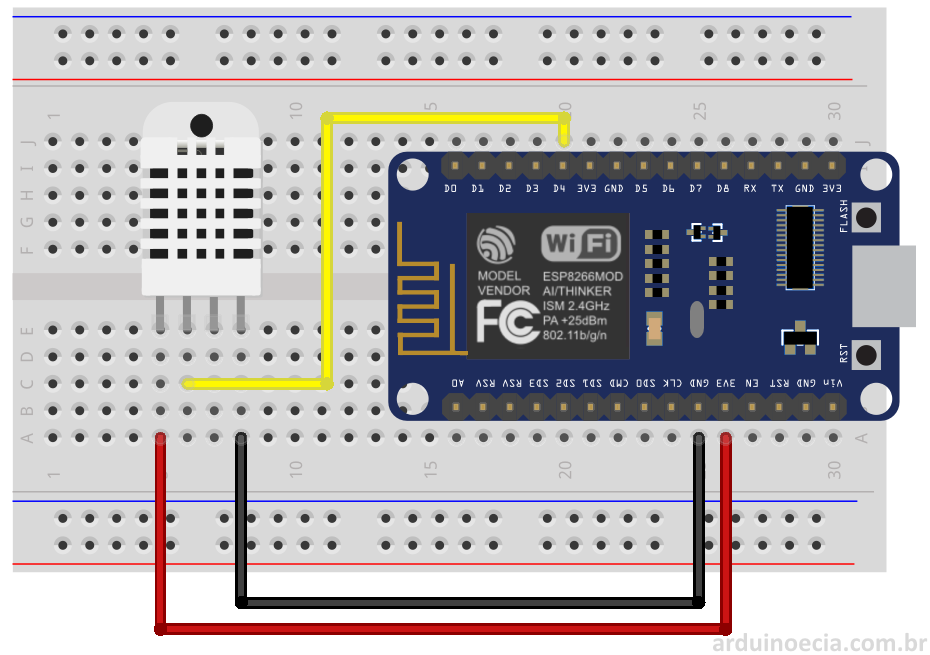

# Estufa IOT

Controle de estufa com ESP8266 + Sensor DHT11 + ThingSpeak

## Local Webserver

## ThingSpeak Integration

## Montagem

* O DHT deve ser ligado na porta D8, caso a porta seja diferente, altere o sketchbook.

