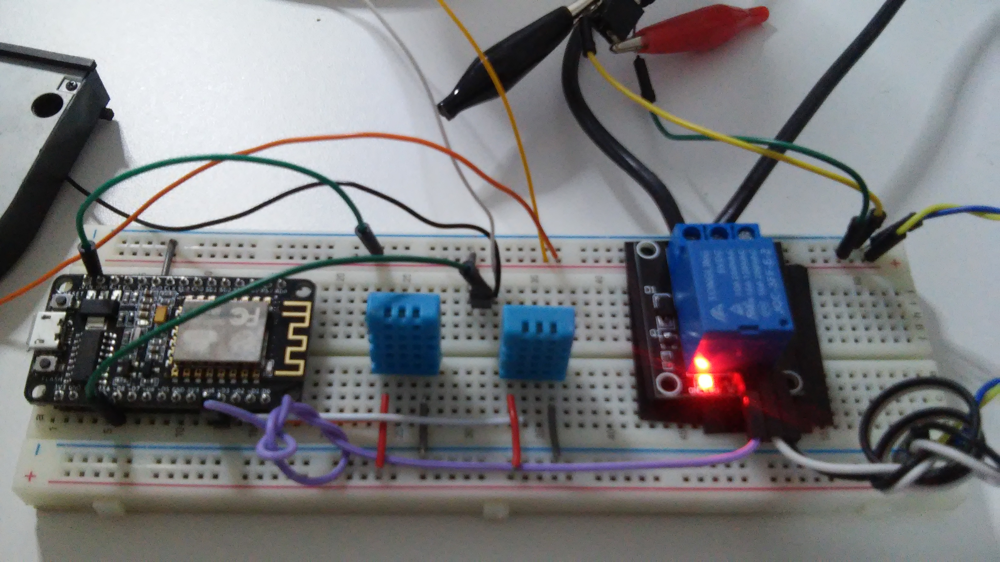
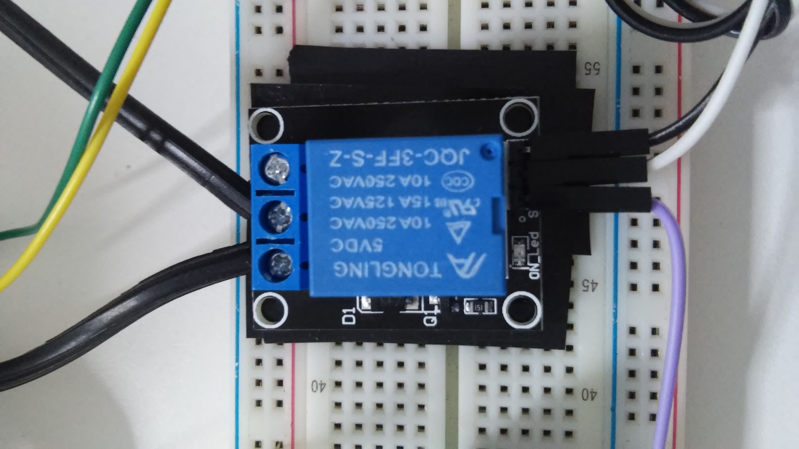
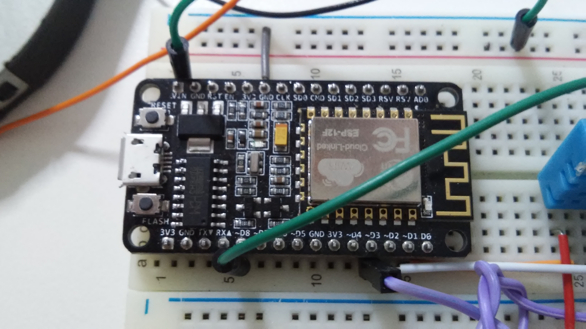
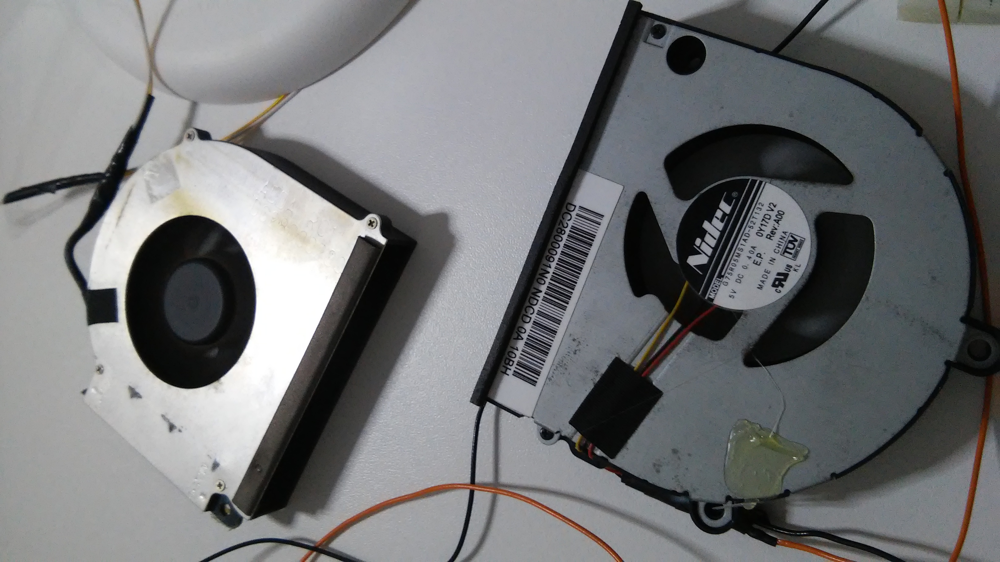
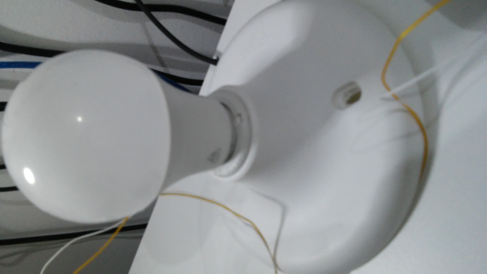
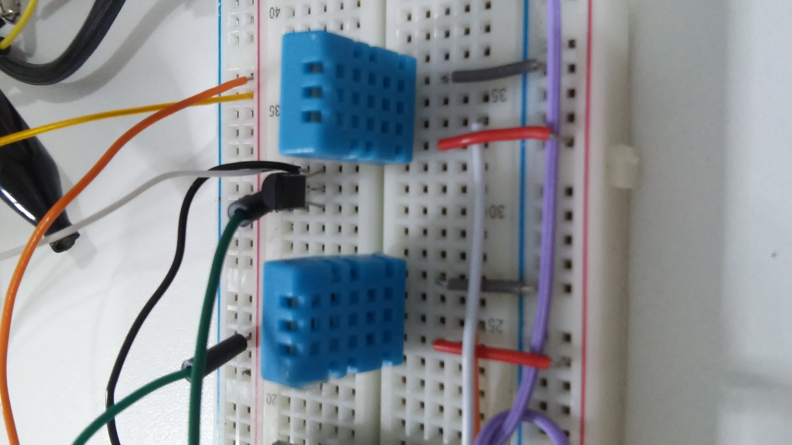
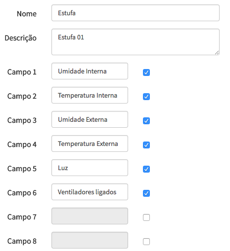
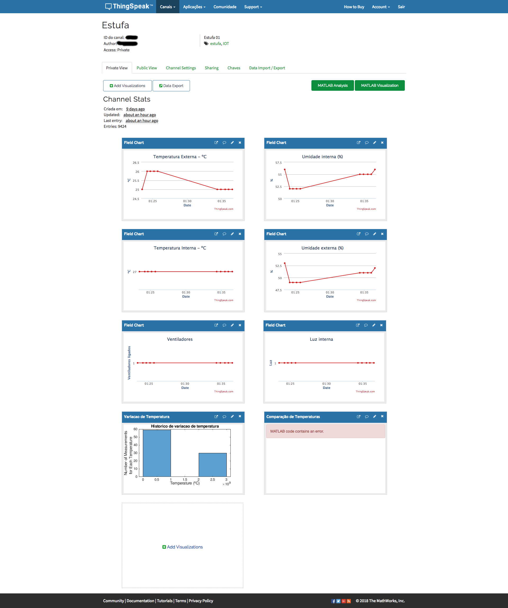

# Estufa IOT

Controle de estufa com ESP8266.

A Estufa IoT possui:

- controle automático de luz
- controle de ventilação
- monitoramento de temperatura e umidade interna e externa
- integração com [ThingSpeak](https://thingspeak.com)

## Material

- Relé de 5v
- Fonte de 5v x 2A
- 2 Ventoinhas de 5v
- ESP8266
- 2 sensores DHT11 ou DHT22
- Fios
- Jumpers
- Placa de prototipagem
- 1 transistor 2N3904 ou compatível

## Montagem

- Ligue os pinos de dados dos sensores DHTs nas portas D1 e D2 e os de energia (positivo e negativo) na placa de prototipagem
- Ligue o pino de dado do relé na porta D3 e os de energia na placa
- Conecte o pino base do transistor (o do meio) na porta D8
- Conecte o pólo negativo de cada ventoinha no coletor do transistor e o emissor no negativo da placa
- Conecte o comum (neutro) da energia elétrica no comum do relé
- Conecte o fase no NC (normalmente fechado) do relé

## Resultado final

## Dúvidas

Qualquer dúvida sobre a montagem, entre em contato com [mrprompt at gmail dot com](mailto:mrprompt@gmail.com) ou abra uma issue.

## Garantia

NENHUMA, use por sua conta e risco.

## Thingspeak

É preciso criar um canal no [ThingSpeak](https://thingspeak.com), os seguintes parâmetros devem ser seguidos:

Com isso, você terá uma visualização parecida com esta:

